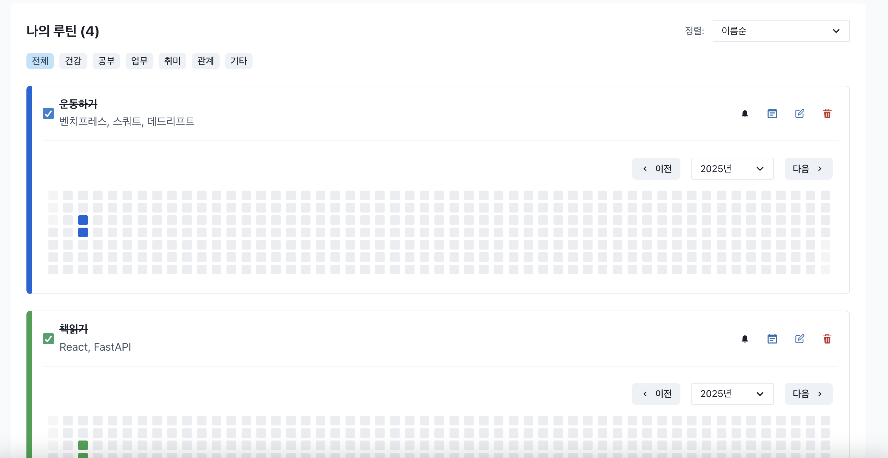
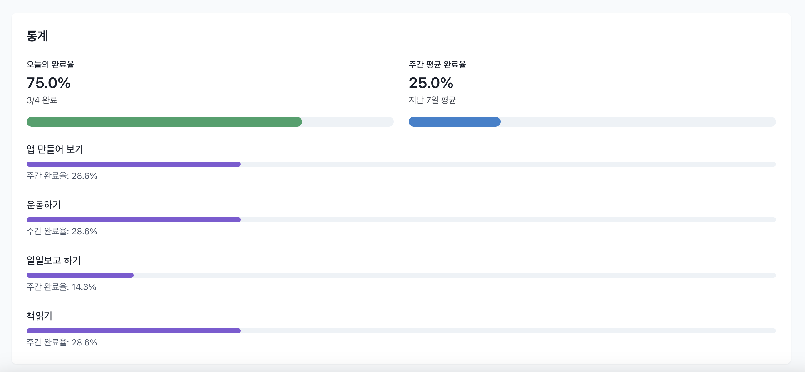

# 습관 추적기 애플리케이션 (Habit Tracker App)

이 프로젝트는 사용자가 루틴을 생성, 수정, 삭제, 완료 상태를 관리할 수 있는 간단한 웹 애플리케이션입니다. React를 사용한 프론트엔드와 FastAPI를 사용한 백엔드로 구성되어 있으며, 완료율 통계와 알림 설정 등 다양한 기능을 제공합니다.

---

## 주요 기능

### **프론트엔드**
- **루틴 관리**: 루틴 추가, 수정, 삭제, 완료 처리.
- **카테고리 필터링**: 건강, 공부, 업무 등 카테고리별 필터링.
- **정렬**: 이름순, 생성일순, 완료율순으로 정렬.
- **통계 시각화**: 일간 및 주간 완료율 통계.
- **데이터 가져오기/내보내기**: JSON 파일 형식으로 데이터를 가져오거나 내보낼 수 있음.
- **사용자 인터페이스**: Chakra UI를 활용한 반응형 디자인.

### **백엔드**
- **CRUD 지원**: 루틴 생성, 읽기, 수정, 삭제.
- **완료 상태 관리**: 루틴 완료 날짜 기록 및 관리.
- **API 제공**: 프론트엔드와 통신하기 위한 RESTful API.
- **데이터 가져오기/내보내기**: JSON 데이터를 처리할 수 있는 API.

---

## 설치 방법

### **사전 요구 사항**
- Node.js 16+
- Python 3.9+
- FastAPI 및 Uvicorn

### **프론트엔드 설치 및 실행**
1. 프로젝트의 `habit-tracker` 폴더로 이동:
   ```bash
   cd habit-tracker
   ```
2. 종속성 설치:
   ```bash
   npm install
   ```
3. 개발 서버 실행:
   ```bash
   npm start
   ```
4. 브라우저에서 `http://localhost:3000`으로 접근.

### **백엔드 설치 및 실행**
1. 프로젝트의 `backend` 폴더로 이동:
   ```bash
   cd backend
   ```
2. Python 종속성 설치:
   ```bash
   pip install -r requirements.txt
   ```
3. FastAPI 서버 실행:
   ```bash
   uvicorn main:app --reload
   ```
4. API는 `http://localhost:8000`에서 사용할 수 있습니다.

---

## 디렉토리 구조

### **프론트엔드**
```
habit-tracker/
├── App.js                  # 메인 애플리케이션 파일
├── components/             # 주요 컴포넌트
│   ├── Calendar.js         # 캘린더 컴포넌트
│   ├── CategorySelect.js   # 카테고리 선택기
│   ├── DataManagement.js   # 데이터 가져오기/내보내기
│   ├── NotificationSettings.js # 알림 설정
│   ├── RoutineForm.js      # 루틴 추가 폼
│   ├── RoutineItem.js      # 루틴 항목
│   ├── RoutineSort.js      # 루틴 정렬
│   └── Statistics.js       # 통계 시각화
├── services/               # API 서비스
│   └── api.js              # API 호출 정의
└── index.js                # 진입점 파일
```

### **백엔드**
```
backend/
├── main.py                 # FastAPI 엔트리포인트
├── models.py               # SQLAlchemy 데이터베이스 모델
├── schemas.py              # Pydantic 스키마 정의
├── crud.py                 # CRUD 로직 구현
├── database.py             # 데이터베이스 초기화
├── routers/                # API 라우터
│   └── routines.py         # 루틴 관련 API 엔드포인트
└── tests/                  # 테스트 코드
```

---

## API 엔드포인트

### **루틴 관리**
- `GET /routines`: 모든 루틴 조회
- `POST /routines`: 새 루틴 생성
- `PUT /routines/{id}`: 특정 루틴 수정
- `DELETE /routines/{id}`: 특정 루틴 삭제

### **루틴 완료 관리**
- `POST /routines/{id}/complete/{date}`: 루틴을 완료로 설정
- `POST /routines/{id}/uncomplete/{date}`: 완료 상태 해제

### **통계 관리**
- `GET /routines/statistics`: 루틴 완료율 통계 제공

---

## 기술 스택

### **프론트엔드**
- React
- Chakra UI
- Axios (API 호출)

### **백엔드**
- FastAPI
- SQLAlchemy
- SQLite

---

## 프로젝트 미리보기

### **루틴 추가 화면**


### **루틴 목록 화면**


### **통계 화면**


---

## 향후 개선 사항
- **사용자 인증**: JWT 기반 인증 추가.
- **반응형 디자인 강화**: 모바일 사용자 경험 최적화.
- **고급 통계**: 월간/연간 통계 제공.
